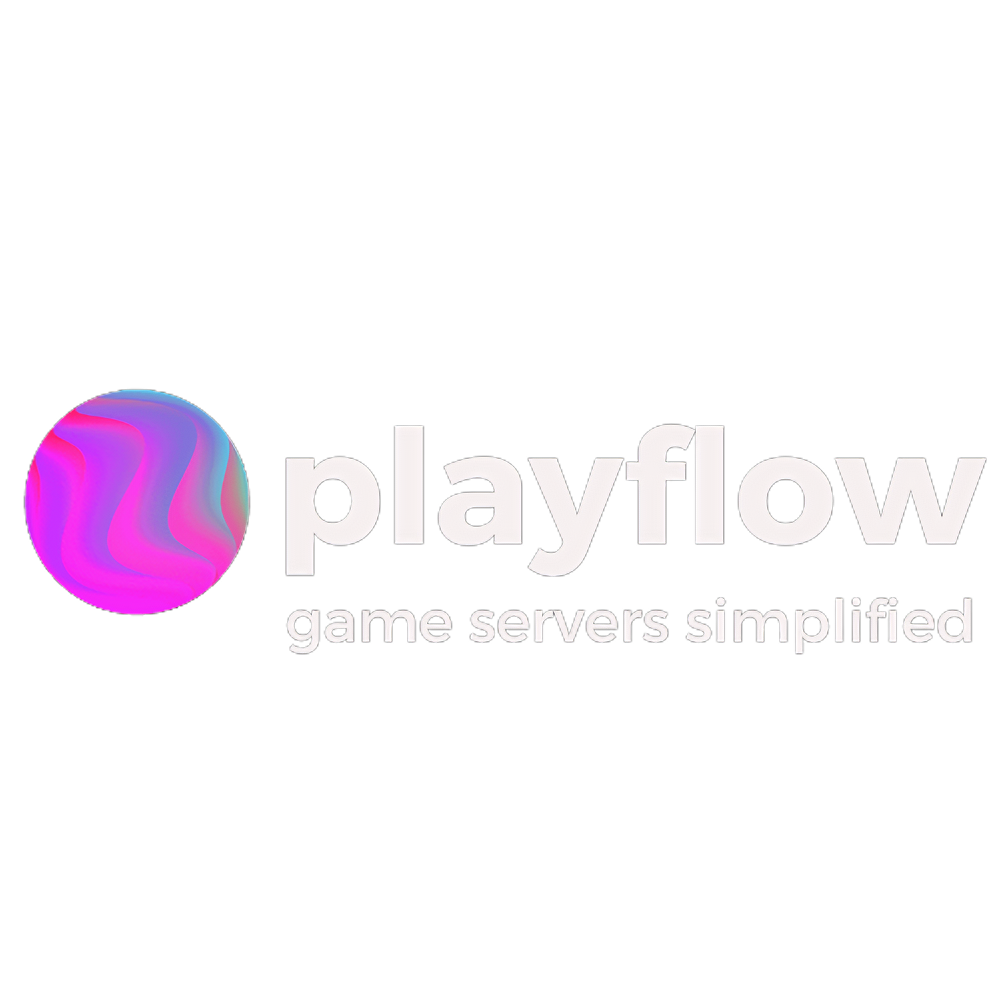

# PlayFlow Multiplayer Unity SDK



The all-in-one Unity SDK for dedicated server hosting, lobbies, and skill-based matchmaking. Go from the Unity Editor to a live multiplayer game in minutes.

---

## What is the PlayFlow SDK?

The PlayFlow Multiplayer SDK is a comprehensive suite of tools designed to remove the complexity of building and managing a multiplayer game. It provides three core services, all accessible through a unified, easy-to-use Unity package.

## Core Features

| Feature | Description | Key Components |
|---|---|---|
| **🚀 One-Click Server Hosting** | Build and deploy dedicated Linux servers for your game directly from the Unity Editor. No command-line or Docker knowledge required. | `PlayFlowCloudDeploy` Window |
| **🤝 Modern Lobby System** | A powerful, event-driven system for creating and managing game lobbies. Fully compatible with WebGL, consoles, and PC. | `PlayFlowLobbyManagerV2` |
| **⚔️ Ticket-Based Matchmaking** | A flexible client for connecting players based on skill, region, or custom game attributes. | `PlayFlowMatchmakerManager` |
| **🎮 Direct Server API** | Programmatic C# access to manage your entire game server fleet for advanced, custom scaling logic. | `PlayflowServerApiClient` |

---

## Installation

1.  In the Unity Editor, open the **Package Manager** (`Window > Package Manager`).
2.  Click the **'+'** icon and select **"Add package from git URL..."**.
3.  Enter the following URL and click **Add**:
    ```
    https://github.com/PlayFlow-Cloud/PlayFlow-Multiplayer-Unity-SDK.git
    ```

---

## Quick Start

### 1. Deploy a Server in One Click

Get your dedicated server running on the PlayFlow cloud without ever leaving the Unity Editor.

1.  Open the deployment window from **PlayFlow > PlayFlow Cloud**.
2.  Enter your **API Token** from your [PlayFlow Dashboard](https://app.playflowcloud.com).
3.  Select your server scene and give your build a version tag (e.g., "v1.0").
4.  Click **Upload Server**.

That's it! PlayFlow handles building the headless Linux binary, uploading it, and making it available to your game clients.

*![A screenshot or GIF of the PlayFlowCloudDeploy editor window would be great here to show the one-click process.]*

### 2. Create and Manage a Lobby

The `PlayFlowLobbyManagerV2` provides a simple, singleton-based interface for all lobby operations. Its event-driven architecture makes it easy to integrate with your UI.

This example shows how to create a lobby and handle the success and error callbacks. This pattern is fully compatible with all platforms, including WebGL.

```csharp
using UnityEngine;
using PlayFlow;
using System;
using System.Collections.Generic;

public class LobbyExample : MonoBehaviour
{
    void Start()
    {
        // The manager is a singleton, easily accessible anywhere.
        // Make sure you have the PlayFlowLobbyManagerV2 prefab in your scene.
        if (PlayFlowLobbyManagerV2.Instance == null)
        {
            Debug.LogError("PlayFlowLobbyManagerV2 not found in scene!");
            return;
        }

        // Initialize with a unique player ID.
        string playerId = "player-" + Guid.NewGuid().ToString("N").Substring(0, 8);
        PlayFlowLobbyManagerV2.Instance.Initialize(playerId, () => {
            Debug.Log("PlayFlow Lobby Manager is ready!");
        });

        // Subscribe to events to make your UI react to lobby changes.
        PlayFlowLobbyManagerV2.Instance.Events.OnLobbyJoined.AddListener(HandleLobbyJoined);
    }

    public void CreateLobby()
    {
        Debug.Log("Creating a new lobby...");
        
        PlayFlowLobbyManagerV2.Instance.CreateLobby(
            "My Awesome Game", 
            maxPlayers: 8, 
            isPrivate: false,
            onSuccess: (createdLobby) => {
                Debug.Log($"Lobby created successfully! ID: {createdLobby.id}");
            },
            onError: (error) => {
                Debug.LogError($"Failed to create lobby: {error}");
            }
        );
    }
    
    private void HandleLobbyJoined(Lobby lobby)
    {
        Debug.Log($"EVENT: Successfully joined lobby '{lobby.name}' with {lobby.currentPlayers} players.");
        // Your logic to transition to the lobby screen would go here.
    }

    void OnDestroy()
    {
        // Unsubscribe from events to prevent memory leaks.
        if (PlayFlowLobbyManagerV2.Instance != null)
        {
            PlayFlowLobbyManagerV2.Instance.Events.OnLobbyJoined.RemoveListener(HandleLobbyJoined);
        }
    }
}
```

### 3. Find a Match

The `PlayFlowMatchmakerManager` uses a simple, ticket-based system to find matches for your players.

```csharp
using UnityEngine;
using PlayFlow;
using System;
using System.Threading;
using System.Threading.Tasks;
using Newtonsoft.Json.Linq; // Add this for JObject handling

public class MatchmakingExample : MonoBehaviour
{
    public async void FindMatch()
    {
        var matchRequest = new PlayFlowMatchmakerManager.MatchRequest(
            matchmakerName: "my-default-matchmaker", 
            playerId: "player-12345"
        );

        // Optionally add more criteria
        matchRequest.Elo = 1200;
        matchRequest.CustomFields.Add("gameMode", "CaptureTheFlag");

        Debug.Log("Finding match...");
        try
        {
            var matchedTicket = await PlayFlowMatchmakerManager.Instance.FindMatchAsync(
                request: matchRequest,
                timeout: TimeSpan.FromSeconds(60) // Wait for up to 60 seconds
            );

            Debug.Log("Match Found!");
            
            // Extract server details from the match ticket
            string ip = matchedTicket["server"]?["network_ports"]?[0]?["host"]?.ToString();
            int port = matchedTicket["server"]?["network_ports"]?[0]?["external_port"]?.ToObject<int>() ?? 0;

            Debug.Log($"Connect to server at {ip}:{port}");
            
            // Connect your networking client (Netcode, Mirror, etc.) here

        }
        catch (TaskCanceledException)
        {
            Debug.LogWarning("Matchmaking timed out or was canceled.");
        }
        catch (Exception e)
        {
            Debug.LogError($"An error occurred during matchmaking: {e.Message}");
        }
    }
}
```

## Documentation & Support

-   **Full Documentation:** For detailed guides and API references, visit our [Official Docs](https://docs.playflowcloud.com).
-   **Community & Support:** Have questions? Join our [Discord Server](https://discord.gg/P5w45Vx5Q8) to chat with the team and other developers.
-   **Contact Us:** For business inquiries, email us at [support@playflowcloud.com](mailto:support@playflowcloud.com).